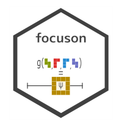

# focuson 

<!-- badges: start -->

<!-- badges: end -->

`focuson` provides tools for the estimation of and inference about
scalar functions of model parameters. The main interface is `focus()`,
which takes as input a fitted model and a user-supplied function of the
model parameters, and returns an estimate and a delta-method standard
error. A `confint()` method can be used to construct inferences. Mean
and median bias-corrected estimators of the focus parameter can be
computed.

The package is useful when the quantity of scientific interest is not a
single model coefficient, but a scalar function of the full parameter
vector, such as an odds ratio, a contrast, a prediction, a marginal
effect, or a quantile.

## Installation

You can install the development version of `focuson` from GitHub with

``` r
install.packages("remotes")
remotes::install_github("ikosmidis/focuson")
```

## Focusing on a model parameter

The following example uses the `endometrial` data set from the
[**brglm2**](https://github.com/ikosmidis/brglm2) R package.

``` r
library("brglm2")
library("focuson")
data("endometrial", package = "brglm2")
endo <- glm(HG ~ NV + PI + EH,
            data = endometrial,
            family = binomial("logit"),
            method = "brglmFit")
```

By default, `focus()` focuses on the first component of the model
parameter vector and returns its median bias-corrected estimate.

``` r
focus(endo)
#> Call:
#> focus.glm(object = endo)
#> 
#> Focus estimate
#>    Estimate Std. Error
#> on   3.9344     1.4887
#> 
#> Type of correction: median
```

The focus can be changed by supplying a function. For example, the
following focuses on the coefficient of `NV`.

``` r
focus(endo, on = function(theta) theta["NV"])
#> Call:
#> focus.glm(object = endo, on = function(theta) theta["NV"])
#> 
#> Focus estimate
#>    Estimate Std. Error
#> on   3.4948     1.5508
#> 
#> Type of correction: median
```

## Focusing on a function of the parameters

The focus can be any scalar function of the full model parameter vector.
For example, an odds ratio for `NV` can be estimated with

``` r
fo_or <- focus(endo, on = function(theta) exp(theta["NV"]))
fo_or
#> Call:
#> focus.glm(object = endo, on = function(theta) exp(theta["NV"]))
#> 
#> Focus estimate
#>    Estimate Std. Error
#> on   29.297     29.021
#> 
#> Type of correction: median
```

Wald-type confidence intervals are available through `confint()`.

``` r
confint(fo_or)
#>     lower     upper 
#> -27.58318  86.17716 
#> attr(,"level")
#> [1] 0.95
#> attr(,"type")
#> [1] "wald"
#> attr(,"se_at")
#> [1] "supplied"
```

The standard error used by default is the one stored in the `focus`
object, evaluated at the parameter estimates supplied by the fitted
model object used internally by `focus()`. A compatible standard error
can instead be requested lazily when constructing a confidence interval.
This evaluates the delta-method standard error at a reconstructed
parameter vector compatible with the method used to estimate the focus
parameter.

``` r
confint(fo_or, se_at = "compatible")
#>     lower     upper 
#> -77.15505 135.74903 
#> attr(,"level")
#> [1] 0.95
#> attr(,"type")
#> [1] "wald"
#> attr(,"se_at")
#> [1] "compatible"
#> attr(,"se_info")
#> attr(,"se_info")$se
#> [1] 54.31326
#> 
#> attr(,"se_info")$theta
#> (Intercept)          NV          PI          EH 
#>   3.9344345   3.3774848  -0.0377999  -2.6966726 
#> 
#> attr(,"se_info")$V
#>             (Intercept)          NV           PI           EH
#> (Intercept)   2.3609628 -0.19397817 -0.038598598 -1.072693017
#> NV           -0.1939782  3.43689114 -0.011982259  0.191304781
#> PI           -0.0385986 -0.01198226  0.001691114  0.006889167
#> EH           -1.0726930  0.19130478  0.006889167  0.638663584
#> 
#> attr(,"se_info")$gradient
#> [1]  0.00000 29.29699  0.00000  0.00000
#> 
#> attr(,"se_info")$replace
#> [1] 2
```

## Analytic derivatives

Numerical derivatives are used by default. Analytic derivatives can be
supplied through `on_gradient` and `on_hessian`.

``` r
focus_fun <- function(theta, i = 1, j = 2) {
    theta[i] - theta[j]
}

focus_grad <- function(theta, i = 1, j = 2) {
    out <- rep(0, length(theta))
    out[i] <- 1
    out[j] <- -1
    out
}

focus_hessian <- function(theta, i = 1, j = 2) {
    matrix(0, nrow = length(theta), ncol = length(theta))
}

focus(endo,
      on = focus_fun,
      on_gradient = focus_grad,
      on_hessian = focus_hessian,
      i = 2, j = 3)
#> Call:
#> focus.glm(object = endo, on = focus_fun, on_gradient = focus_grad, 
#>     on_hessian = focus_hessian, i = 2, j = 3)
#> 
#> Focus estimate
#>    Estimate Std. Error
#> on   3.5271     1.5579
#> 
#> Type of correction: median
```

For linear functions of the parameters, mean bias reduction is
equivariant to the transformation.

``` r
focus(endo, on = focus_fun, i = 2, j = 3, correction = "mean")
#> Call:
#> focus.glm(object = endo, on = focus_fun, correction = "mean", 
#>     i = 2, j = 3)
#> 
#> Focus estimate
#>    Estimate Std. Error
#> on    2.964     1.5579
#> 
#> Type of correction: mean
coef(endo)[2] - coef(endo)[3]
#>       NV 
#> 2.964025
```

## HulC confidence intervals

HulC confidence intervals can also be constructed from `focus()`
objects. The statistic is recomputed on data partitions using the same
focus specification.

``` r
set.seed(678)
confint(focus(endo), method = "hulc")
```

## Low-level use

The low-level `focus_engine()` interface works directly with a parameter
vector and other model quantities. It is intended for advanced use and
for models that are not handled by a high-level `focus()` method.

``` r
data("coalition", package = "brglm2")
coalition_fit <- glm(duration ~ fract + numst2,
                     family = Gamma,
                     data = coalition,
                     method = "brglmFit",
                     type = "ML")
afuns <- enrichwith::get_auxiliary_functions(coalition_fit)
theta <- coef(coalition_fit, model = "full")
engine_fit <- focus_engine(theta = theta,
                           components = list(V = vcov(coalition_fit, model = "full"),
                                             P = afuns$Pmat(),
                                             Q = afuns$Qmat()),
                           on = function(theta) exp(theta[1]),
                           correction = "mean")
engine_fit
#> Call:
#> focus_engine(theta = theta, components = list(V = vcov(coalition_fit, 
#>     model = "full"), P = afuns$Pmat(), Q = afuns$Qmat()), on = function(theta) exp(theta[1]), 
#>     correction = "mean")
#> 
#> Focus estimate
#>    Estimate Std. Error
#> on  0.98294     0.0145
#> 
#> Type of correction: mean
```

This agrees with the corresponding high-level call.

``` r
focus(coalition_fit,
      on = function(theta) exp(theta[1]),
      correction = "mean")
#> Call:
#> focus.glm(object = coalition_fit, on = function(theta) exp(theta[1]), 
#>     correction = "mean")
#> 
#> Focus estimate
#>    Estimate Std. Error
#> on  0.98294     0.0145
#> 
#> Type of correction: mean
```

## References

Kosmidis I (2014). Bias in parametric estimation: reduction and useful
side-effects. *WIRE Computational Statistics*, **6**, 185–196.
doi:10.1002/wics.1296.

Kuchibhotla A K, Balakrishnan S, Wasserman L (2023). The HulC:
confidence regions from convex hulls. *Journal of the Royal Statistical
Society: Series B*, **85**, 1461–1491. doi:10.1093/jrsssb/qkad134.
